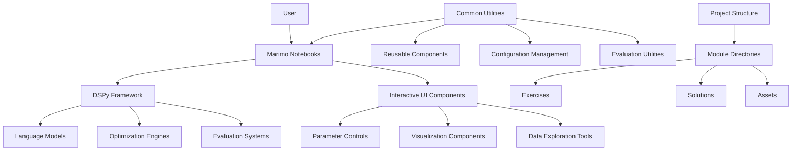
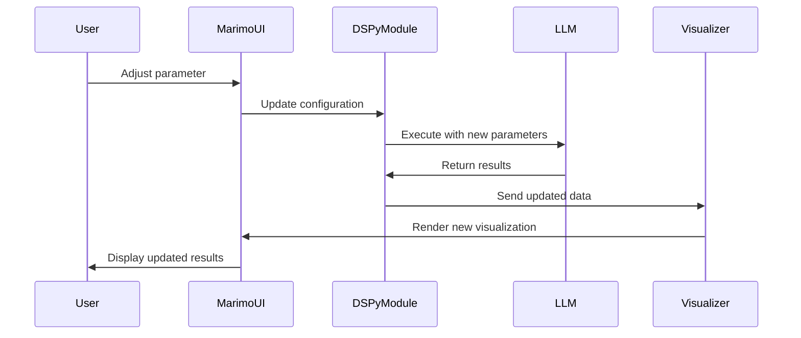

# Design Document

## Overview

The DSPy Zero-to-Expert learning repository is designed as a comprehensive, interactive educational platform that teaches DSPy (a framework for programming with language models) through progressive, hands-on lessons using Marimo reactive notebooks. The system leverages Marimo's reactive programming model to create an engaging learning experience where parameter changes immediately update results, enabling real-time experimentation with DSPy concepts.

The architecture follows a modular, progressive learning approach with 10 distinct modules, each building upon previous knowledge while introducing new concepts. The system integrates DSPy's powerful optimization and evaluation capabilities with Marimo's interactive UI elements to create an immersive learning environment.

## Architecture

### High-Level Architecture



### Module Architecture

Each learning module follows a consistent architectural pattern:

1. **Setup Layer**: Environment configuration and dependency management
2. **Concept Layer**: Interactive introduction to core concepts
3. **Implementation Layer**: Hands-on coding exercises with DSPy
4. **Optimization Layer**: Performance tuning and evaluation
5. **Integration Layer**: Connecting concepts to real-world applications

### Technology Stack

- **Core Framework**: DSPy for language model programming
- **Interactive Environment**: Marimo for reactive notebooks
- **Package Management**: uv for fast dependency resolution
- **Language Models**: OpenAI, Anthropic, Cohere integration
- **Vector Databases**: FAISS, ChromaDB, Qdrant support
- **Evaluation**: Custom metrics and A/B testing frameworks
- **Visualization**: Plotly, Matplotlib for interactive charts

## Components and Interfaces

### Core Components

#### 1. Learning Module System

**Purpose**: Manages the progressive learning structure across 10 modules

**Key Classes**:

- `ModuleManager`: Orchestrates module progression and prerequisites
- `LearningPath`: Defines alternative entry points for different skill levels
- `ProgressTracker`: Monitors completion status and learning outcomes

**Interfaces**:

```python
class ILearningModule:
    def setup_environment(self) -> None
    def load_concepts(self) -> List[Concept]
    def get_exercises(self) -> List[Exercise]
    def validate_completion(self) -> bool
```

#### 2. Interactive Notebook System

**Purpose**: Provides reactive Marimo notebooks with DSPy integration

**Key Classes**:

- `ReactiveNotebook`: Base class for all learning notebooks
- `ParameterController`: Manages interactive UI elements
- `ResultVisualizer`: Handles real-time result updates

**Interfaces**:

```python
class IInteractiveNotebook:
    def create_ui_elements(self) -> Dict[str, UIElement]
    def bind_parameters(self, dspy_module: dspy.Module) -> None
    def update_results(self, parameters: Dict) -> None
```

#### 3. DSPy Integration Layer

**Purpose**: Bridges DSPy framework with Marimo's reactive system

**Key Classes**:

- `DSPyModuleWrapper`: Wraps DSPy modules for reactive updates
- `SignatureTester`: Interactive signature testing interface
- `OptimizationTracker`: Monitors optimization progress

**Interfaces**:

```python
class IDSPyIntegration:
    def wrap_module(self, module: dspy.Module) -> ReactiveModule
    def create_signature_tester(self, signature: dspy.Signature) -> SignatureTester
    def track_optimization(self, optimizer: dspy.Optimizer) -> OptimizationTracker
```

#### 4. Exercise and Evaluation System

**Purpose**: Manages hands-on exercises and provides immediate feedback

**Key Classes**:

- `ExerciseRunner`: Executes and validates exercises
- `SolutionProvider`: Provides reference solutions
- `FeedbackGenerator`: Creates personalized feedback

**Interfaces**:

```python
class IExerciseSystem:
    def run_exercise(self, exercise: Exercise, solution: str) -> Result
    def provide_hints(self, exercise: Exercise, attempt: str) -> List[str]
    def validate_solution(self, exercise: Exercise, solution: str) -> bool
```

### Component Interactions

#### Reactive Data Flow



## Data Models

### Core Data Structures

#### Learning Progress Model

```python
@dataclass
class LearningProgress:
    user_id: str
    module_id: str
    completion_status: CompletionStatus
    exercises_completed: List[str]
    time_spent: timedelta
    performance_metrics: Dict[str, float]
    last_accessed: datetime
```

#### Exercise Model

```python
@dataclass
class Exercise:
    id: str
    module_id: str
    title: str
    description: str
    difficulty_level: DifficultyLevel
    prerequisites: List[str]
    dspy_concepts: List[str]
    starter_code: str
    solution_template: str
    validation_criteria: List[ValidationRule]
```

#### DSPy Configuration Model

```python
@dataclass
class DSPyConfig:
    language_model: str
    temperature: float
    max_tokens: int
    optimization_strategy: str
    evaluation_metrics: List[str]
    custom_parameters: Dict[str, Any]
```

#### Interactive Component Model

```python
@dataclass
class InteractiveComponent:
    component_type: ComponentType
    parameters: Dict[str, Any]
    binding_target: str
    update_callback: Callable
    validation_rules: List[ValidationRule]
```

### Data Persistence

- **Configuration Files**: TOML format for project settings
- **Progress Tracking**: JSON files for user progress
- **Exercise Solutions**: Python files with embedded metadata
- **Evaluation Results**: Structured logs for performance analysis

## Error Handling

### Error Categories

#### 1. Environment Setup Errors

- **Missing Dependencies**: Automated detection and installation guidance
- **API Key Issues**: Clear error messages with setup instructions
- **Version Conflicts**: Dependency resolution with uv package manager

#### 2. DSPy Integration Errors

- **Model Configuration**: Fallback to default models with warnings
- **Optimization Failures**: Graceful degradation with alternative strategies
- **Signature Validation**: Clear feedback on signature definition issues

#### 3. Interactive Component Errors

- **Parameter Validation**: Real-time validation with user feedback
- **Reactive Update Failures**: Error boundaries to prevent cascade failures
- **UI Rendering Issues**: Fallback to basic components

#### 4. Exercise Execution Errors

- **Code Execution**: Sandboxed execution with detailed error reporting
- **Solution Validation**: Multiple validation strategies with partial credit
- **Resource Limitations**: Timeout handling and resource monitoring

### Error Recovery Strategies

```python
class ErrorHandler:
    def handle_setup_error(self, error: SetupError) -> RecoveryAction:
        """Provides automated recovery for environment setup issues"""
        
    def handle_dspy_error(self, error: DSPyError) -> RecoveryAction:
        """Manages DSPy-specific errors with fallback strategies"""
        
    def handle_interactive_error(self, error: InteractiveError) -> RecoveryAction:
        """Maintains UI responsiveness during component failures"""
        
    def handle_exercise_error(self, error: ExerciseError) -> RecoveryAction:
        """Provides educational feedback for exercise failures"""
```

## Testing Strategy

### Testing Pyramid

#### 1. Unit Tests

- **DSPy Module Wrappers**: Test reactive integration
- **Interactive Components**: Validate UI element behavior
- **Exercise Validators**: Ensure correct solution checking
- **Configuration Management**: Test environment setup

#### 2. Integration Tests

- **Marimo-DSPy Integration**: End-to-end reactive flow
- **LLM Provider Integration**: Multi-provider compatibility
- **Exercise Execution Pipeline**: Complete exercise workflow
- **Progress Tracking**: User journey validation

#### 3. End-to-End Tests

- **Complete Module Workflows**: Full learning module execution
- **Multi-Module Progression**: Learning path validation
- **Performance Benchmarks**: Optimization effectiveness
- **User Experience Flows**: Interactive learning scenarios

### Testing Infrastructure

```python
class TestFramework:
    def setup_test_environment(self) -> TestEnvironment:
        """Creates isolated test environment with mock LLMs"""
        
    def run_interactive_tests(self, notebook: MarimoNotebook) -> TestResults:
        """Tests reactive behavior in Marimo notebooks"""
        
    def validate_exercise_solutions(self, exercises: List[Exercise]) -> ValidationResults:
        """Ensures all exercises have correct solutions"""
        
    def benchmark_performance(self, modules: List[Module]) -> PerformanceMetrics:
        """Measures learning effectiveness and system performance"""
```

### Continuous Integration

- **Automated Testing**: GitHub Actions for all test levels
- **Dependency Updates**: Automated uv dependency management
- **Documentation Generation**: Auto-generated API documentation
- **Performance Monitoring**: Continuous performance regression testing

## Implementation Considerations

### Scalability

- **Modular Architecture**: Independent module loading and execution
- **Resource Management**: Efficient memory usage for large datasets
- **Caching Strategy**: Intelligent caching of LLM responses and computations
- **Parallel Execution**: Support for concurrent exercise execution

### Accessibility

- **Screen Reader Support**: Semantic HTML in Marimo components
- **Keyboard Navigation**: Full keyboard accessibility
- **Color Contrast**: High contrast themes for visualizations
- **Text Alternatives**: Alt text for all visual elements

### Internationalization

- **Content Localization**: Support for multiple languages
- **Cultural Adaptation**: Region-specific examples and use cases
- **RTL Support**: Right-to-left language compatibility
- **Locale-Aware Formatting**: Numbers, dates, and currency formatting

### Security

- **Code Execution Sandboxing**: Safe execution of user code
- **API Key Management**: Secure storage and rotation
- **Input Validation**: Comprehensive input sanitization
- **Access Control**: Role-based access to advanced features
